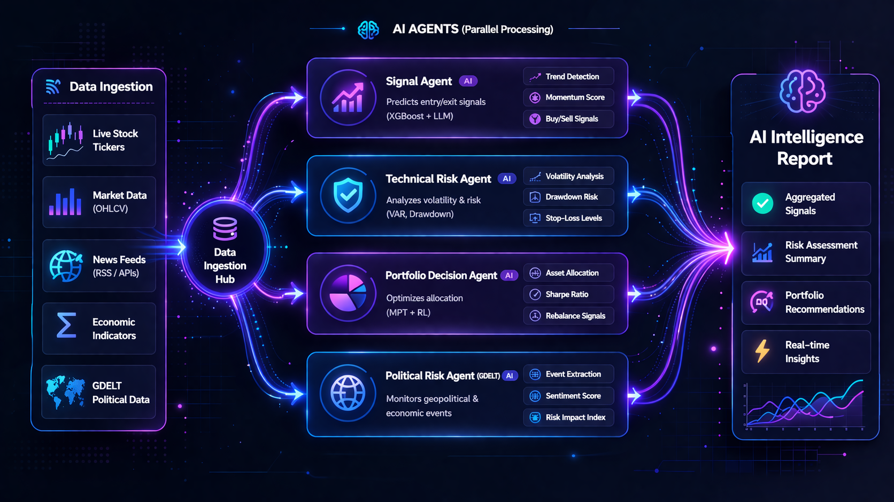
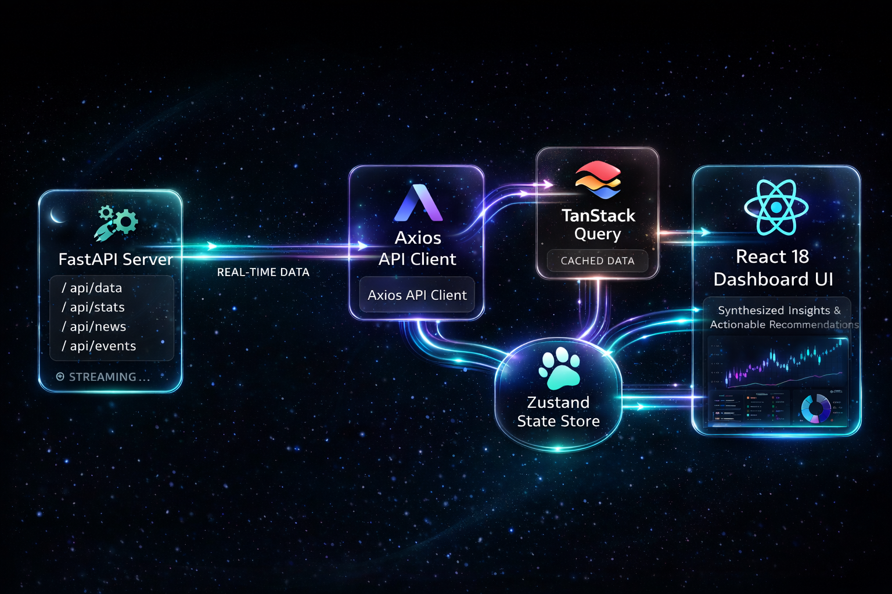

<div align="center">

# 🛡️ MarketSentinel UI

**Real-time AI-powered market intelligence dashboard for quantitative trading**

[](https://github.com/muhammedshihab1001/MarketSentinel-UI/actions)
[](#)
[](#)
[](#)
[](#)
[](./LICENSE)

> A premium dark-mode HUD interfacing with a FastAPI + XGBoost ML backend to deliver live market signals, AI agent reasoning, drift detection, and portfolio analytics — in real time.

**Backend Repo:** [MarketSentinel](https://github.com/muhammedshihab1001/MarketSentinel)

</div>

---

## Table of Contents

1. [Overview](#-overview)
2. [Key Features](#-key-features)
3. [Tech Stack](#️-tech-stack)
4. [Visual Walkthrough](#-visual-walkthrough)
5. [Architecture](#️-architecture)
6. [Project Structure](#-project-structure)
7. [Getting Started](#-getting-started)
8. [Environment Variables](#-environment-variables)
9. [Docker Deployment](#-docker-deployment)
10. [Pages Reference](#-pages-reference)
11. [API Endpoints](#-api-endpoints)
12. [Access Modes](#-access-modes)
13. [Security](#-security)
14. [CI Pipeline](#-ci-pipeline)

---

## 📋 Overview

**MarketSentinel UI** is a React 18 + TypeScript frontend for an institutional-grade quantitative trading intelligence system. It connects to a FastAPI backend running an XGBoost ensemble model and a multi-agent LLM reasoning pipeline to deliver:

- **Live LONG / SHORT / NEUTRAL signals** for a universe of 100 monitored S&P 500 equities
- **AI-powered rationale** from a 4-agent system (SignalAgent, TechnicalRiskAgent, PoliticalRiskAgent, PortfolioDecisionAgent)
- **Drift detection** with automatic weight scaling and alert states
- **Portfolio exposure tracking** with gross/net breakdown
- **Backtested strategy performance** reporting with institutional risk metrics

The interface is designed as a professional dark-mode HUD — optimised for traders, analysts, and quantitative researchers.

---

## 🚀 Key Features

| Feature | Description |
|---|---|
| 🔴 **Live Signal Grid** | Real-time LONG / SHORT / NEUTRAL signals with direction filters and ticker search |
| 🤖 **LLM Intelligence Reports** | 4-panel AI analysis: Summary, Rationale, Outlook, Risk Commentary |
| 🌊 **Drift Detection** | Live stability monitoring with severity scoring (0–15) and exposure auto-scaling |
| 📊 **Portfolio Ledger** | Gross/Net exposure gauges with position breakdown and weight distribution |
| 🧠 **Model Telemetry** | Feature importance, IC stats, signal quality grade, artifact integrity hashes |
| 🛡️ **Political Risk Scan** | GDELT-powered geopolitical risk scoring with 6-provider fallback chain |
| 📈 **Performance Backtesting** | Sharpe, Sortino, Calmar, Max Drawdown, Hit Rate, Annual Return |
| 💚 **System Health** | Unified connectivity monitor for API, PostgreSQL, Redis, and ML model |
| 🖥️ **Prometheus Monitoring** | Live request histograms, error rates, cache efficiency, inference counts |
| 🔐 **Role-Based Access** | Owner (full) and Demo (quota-limited) modes with automatic lockout UI |

---

## 🛠️ Tech Stack

| Layer | Technology | Version |
|---|---|---|
| Framework | React + Vite | 18.2 + 7.3.1 |
| Language | TypeScript | 5.2 |
| Styling | Tailwind CSS + ShadCN UI | 3.4 |
| Animations | Framer Motion | 11.0 |
| Charts | Recharts | 2.12 |
| Server State | TanStack React Query | v5.28 |
| Client State | Zustand | 4.5 |
| HTTP Client | Axios + interceptors | 1.6 |
| Icons | lucide-react | 0.363 |
| Notifications | Sonner | — |
| Routing | React Router DOM | 6.22 |
| Deployment | Vercel Edge CDN | — |

---

## 📸 Visual Walkthrough

---

### 🏠 Dashboard

> Central command hub — signal counts, top-5 opportunities, exposure gauges, equity curve, and market bias chart.

<table>
  <tr>
    <td><br/><sub><b>Metric Cards + Market Bias</b></sub></td>
    <td><br/><sub><b>Top 5 Opportunities Grid</b></sub></td>
  </tr>
</table>

---

### 📡 Market Signals

> Full universe of LONG / SHORT / NEUTRAL signals with direction filters, ticker search, and live sync.

<table>
  <tr>
    <td><br/><sub><b>Signal Grid — All View</b></sub></td>
    <td><br/><sub><b>Filtered — LONG Signals</b></sub></td>
  </tr>
</table>

---

### 🔍 Signal Detail

> Per-ticker drilldown: price history chart, agent vote breakdown, and full signal rationale.

<table>
  <tr>
    <td><br/><sub><b>Analysis Panel</b></sub></td>
    <td><br/><sub><b>Agent Votes + LLM Report</b></sub></td>
  </tr>
</table>

---

### 🤖 Agent Analysis

> Multi-agent LLM reasoning: AI Intelligence Report (4-panel), Political Risk scan, volatility tags, and price history.

<table>
  <tr>
    <td><br/><sub><b>Analysis Header + Score Tags</b></sub></td>
    <td><br/><sub><b>AI Intelligence Report</b></sub></td>
  </tr>
  <tr>
    <td><br/><sub><b>Political Risk + Price Chart</b></sub></td>
    <td><br/><sub><b>Additional Rationale</b></sub></td>
  </tr>
</table>

---

### 📊 Portfolio Analytics

> Real-time gross/net exposure tracking with position breakdown and weight distribution.

<table>
  <tr>
    <td><br/><sub><b>Exposure Gauges</b></sub></td>
    <td><br/><sub><b>Position Ledger</b></sub></td>
  </tr>
</table>

---

### 📈 Strategy Performance

> Total Return, Risk Score (Sharpe), Downside Protection (Sortino), Recovery Speed (Calmar), Max Loss, Hit Rate.

<table>
  <tr>
    <td><br/><sub><b>Risk Metric Grid</b></sub></td>
    <td></td>
  </tr>
</table>

---

### 🧠 AI Model

> Model version, feature importance ranking, IC telemetry (signal quality grade), and artifact integrity hashes.

<table>
  <tr>
    <td><br/><sub><b>Model Version + IC Stats</b></sub></td>
    <td><br/><sub><b>Feature Importance Bars</b></sub></td>
  </tr>
</table>

---

### 🌊 Drift Monitor

> Live algorithmic drift state, severity score (0–15), exposure scaling factor, and baseline metadata.

<table>
  <tr>
    <td><br/><sub><b>Drift State + Severity</b></sub></td>
    <td></td>
  </tr>
</table>

---

### 💚 Health Center

> Unified connectivity status: API server, PostgreSQL database, Redis cache, and ML model loader.

<table>
  <tr>
    <td><br/><sub><b>All Systems Online</b></sub></td>
    <td></td>
  </tr>
</table>

---

### 🖥️ System Monitor

> Prometheus metrics, request history, per-endpoint bar chart, cache hit rate, and error rate. Owner-only.

<table>
  <tr>
    <td><br/><sub><b>Status Strip + Stat Cards</b></sub></td>
    <td></td>
  </tr>
</table>

---

### 📉 Metrics View

> High-velocity signal telemetry and real-time model output monitoring table.

<table>
  <tr>
    <td><br/><sub><b>Signal Telemetry View</b></sub></td>
    <td></td>
  </tr>
</table>

---

### 👤 Demo Profile

> Quota tracker, per-feature usage dashboard, and locked feature gate for demo users.

<table>
  <tr>
    <td><br/><sub><b>Quota Usage View</b></sub></td>
    <td></td>
  </tr>
</table>

---

### 🔐 Login

> Secure access control for owner (full access) and demo (quota-limited) users.

<table>
  <tr>
    <td width="50%"><br/><sub><b>Authentication Screen</b></sub></td>
    <td width="50%"><br/><sub><b>Auth Actions</b></sub></td>
  </tr>
</table>

---

## 🏗️ Architecture

### Platform Overview
<div align="center">
  
</div>

### Multi-Agent Decision Pipeline
<div align="center">
  
</div>

### Background Inference & Redis Caching
<div align="center">
  
</div>

---

## 📁 Project Structure

```
market-sentinel-ui/
├── public/
│   └── screenshots/                  ← UI screenshots for README
├── src/
│   ├── App.tsx                       ← Route definitions + protected routes
│   ├── main.tsx                      ← Entry point
│   ├── index.css                     ← Design tokens + global styles
│   ├── charts/                       ← Recharts chart components
│   ├── components/                   ← Shared UI components
│   │   ├── DriftIndicator.tsx        ← Severity meter (0–15 scale)
│   │   ├── MetricCard.tsx            ← KPI stat card
│   │   ├── NeuralScanner.tsx         ← Animated scan effect
│   │   ├── SignalBadge.tsx           ← LONG / SHORT / NEUTRAL badge
│   │   ├── SignalCard.tsx            ← Ticker signal tile
│   │   ├── SignalExplanation.tsx     ← Per-ticker rationale panel
│   │   ├── DemoBanner.tsx            ← Quota warning banner
│   │   ├── LockedFeature.tsx         ← Quota exhausted gate component
│   │   └── ui/                       ← ShadCN base components
│   ├── layouts/
│   │   └── DashboardLayout.tsx       ← Sidebar + navigation shell
│   ├── lib/
│   │   ├── api.ts                    ← Typed Axios client (all endpoints + interceptors)
│   │   ├── queryKeys.ts              ← TanStack Query key registry
│   │   └── utils.ts                  ← Utility helpers
│   ├── pages/                        ← One file per route
│   │   ├── Dashboard.tsx             ← /
│   │   ├── MarketSignals.tsx         ← /signals
│   │   ├── SignalDetail.tsx          ← /signals/:ticker
│   │   ├── AgentExplanation.tsx      ← /agent-explain
│   │   ├── PortfolioAnalytics.tsx    ← /portfolio
│   │   ├── StrategyPerformance.tsx   ← /performance
│   │   ├── Model.tsx                 ← /model
│   │   ├── Drift.tsx                 ← /drift
│   │   ├── Health.tsx                ← /health
│   │   ├── Monitoring.tsx            ← /monitoring (owner only)
│   │   ├── Metrics.tsx               ← /metrics
│   │   ├── DemoProfile.tsx           ← /profile
│   │   ├── Login.tsx                 ← /login
│   │   └── ModelOffline.tsx          ← /model-offline
│   ├── store/
│   │   ├── index.ts                  ← App store (selectedTicker, theme, sidebar)
│   │   └── authStore.ts              ← Auth role + per-feature quota tracking
│   └── types/
│       └── index.ts                  ← All TypeScript interfaces aligned to backend
├── .github/workflows/
│   └── frontend-ci.yml               ← npm ci + tsc --noEmit + npm run build
├── .env.example                      ← Environment variable documentation
├── vercel.json                       ← React Router SPA rewrite rules
├── Dockerfile                        ← Multi-stage Nginx production image
├── vite.config.ts                    ← Dev proxy + vendor chunk splitting
├── tailwind.config.js
└── package.json
```

---

## 💻 Getting Started

### Prerequisites
- Node.js 18+
- npm 9+
- Running [MarketSentinel Backend](https://github.com/muhammedshihab1001/MarketSentinel)

### Installation

```bash
# Clone the repo
git clone https://github.com/muhammedshihab1001/MarketSentinel-UI.git
cd MarketSentinel-UI

# Install dependencies
npm install

# Configure environment
cp .env.example .env
# Set VITE_API_BASE_URL to your backend URL
# Set VITE_GRAFANA_URL if you have Grafana running
```

### Development

```bash
npm run dev
# App runs at http://localhost:5173
# API requests proxy to VITE_API_BASE_URL or http://localhost:8000
```

### Production Build

```bash
npm run build     # TypeScript check + Vite bundle (1374 modules)
npm run preview   # Preview production build locally
```

### Type Check

```bash
npx tsc --noEmit  # Must exit 0 — zero TypeScript errors
```

---

## 🌐 Environment Variables

| Variable | Required | Default | Description |
|---|---|---|---|
| `VITE_API_BASE_URL` | Production only | — | FastAPI backend URL (e.g. `https://yourapi.com`). Leave unset in dev — Vite proxy handles it. |
| `VITE_GRAFANA_URL` | Optional | — | Grafana dashboard base URL. When unset, the Grafana link in Monitoring is hidden. |
| `VITE_API_TIMEOUT` | Optional | `15000` | Axios request timeout in milliseconds |

> **Vercel deployment:** Set `VITE_API_BASE_URL`, `VITE_GRAFANA_URL`, and `VITE_API_TIMEOUT` in Vercel project settings → Environment Variables.

---

## 🐳 Docker Deployment

```bash
# Build multi-stage Nginx image
docker build -t market-sentinel-ui .

# Run on port 80
docker run -p 80:80 market-sentinel-ui
```

---

## 📄 Pages Reference

| Page | Route | Access | Description |
|---|---|---|---|
| Dashboard | `/` | All | Signal overview, top-5, equity curve, market bias donut |
| Market Signals | `/signals` | All | Full 100-ticker signal grid with filters and search |
| Signal Detail | `/signals/:ticker` | All | Per-ticker price chart, agent votes, rationale |
| Agent Analysis | `/agent-explain` | Demo / Owner | 4-panel LLM intelligence report + political risk |
| Portfolio Analytics | `/portfolio` | Demo / Owner | Gross/Net exposure gauges + position ledger |
| Strategy Performance | `/performance` | Demo / Owner | Sharpe, Sortino, Calmar, max drawdown, hit rate |
| AI Model | `/model` | Demo / Owner | Feature importance, IC telemetry, artifact hashes |
| Drift Monitor | `/drift` | Demo / Owner | Drift severity 0–15, baseline info, retrain status |
| Health Center | `/health` | All | API, PostgreSQL, Redis, model connectivity |
| System Monitor | `/monitoring` | **Owner only** | Prometheus metrics, request charts, error rates |
| Metrics View | `/metrics` | **Owner only** | Signal telemetry and model output table |
| Demo Profile | `/profile` | Demo | Per-feature quota usage and reset countdown |
| Login | `/login` | Public | Owner credentials or demo access button |
| Model Offline | `/model-offline` | Public | Graceful degradation when model is not loaded |

---

## 📡 API Endpoints

All requests use `withCredentials: true` (httpOnly JWT cookie). Base URL from `VITE_API_BASE_URL`.

| Method | Endpoint | Purpose |
|---|---|---|
| `POST` | `/snapshot` | Full inference → 100 signals |
| `GET` | `/predict/live-snapshot` | Same (GET alias) |
| `GET` | `/predict/signal-explanation/:ticker` | Per-ticker explanation |
| `GET` | `/predict/price-history/:ticker` | 90-day OHLCV price history |
| `GET` | `/agent/explain?ticker=X` | Agent + LLM reasoning report |
| `GET` | `/agent/political-risk?ticker=X` | GDELT geopolitical risk |
| `GET` | `/agent/agents` | 4-agent descriptions + weights |
| `GET` | `/portfolio` | Portfolio positions + exposure |
| `GET` | `/drift` | Drift state + severity score (0–15) |
| `GET` | `/performance?days=N` | Strategy performance metrics |
| `GET` | `/model/info` | Model version + artifact hashes |
| `GET` | `/model/feature-importance` | XGBoost feature importance |
| `GET` | `/model/ic-stats?days=30` | Spearman IC statistics (owner only) |
| `GET` | `/health/ready` | System readiness check |
| `GET` | `/metrics` | Prometheus metrics (owner only) |
| `GET` | `/equity/:ticker/history?days=N` | OHLCV price data |
| `POST` | `/auth/owner-login` | Owner login → JWT cookie |
| `POST` | `/auth/demo-login` | Demo login → JWT cookie |
| `GET` | `/auth/me` | Current session + quota state |
| `POST` | `/auth/logout` | Clear JWT cookie |

---

## 🔐 Access Modes

| Mode | Login | Quota | Access |
|---|---|---|---|
| **Owner** | Username + password | Unlimited | All pages including System Monitor and Metrics |
| **Demo** | One click | 10 req per feature per 7 days | All pages except owner-only; locked after quota |

Demo quota groups: `snapshot` · `portfolio` · `drift` · `performance` · `agent` · `signals`

Each group has an independent 10-request quota. `fully_locked` is only true when all 6 groups are exhausted.

---

## 🔒 Security

| Control | Implementation |
|---|---|
| **Auth tokens** | `httpOnly` cookie sessions — JavaScript never reads the token |
| **XSS** | Zero `dangerouslySetInnerHTML` or `eval()` usage |
| **Tabnapping** | All `window.open(_blank)` calls include `noopener,noreferrer` |
| **Sensitive storage** | `localStorage` persists only UI preferences — no credentials or tokens |
| **CSRF** | `withCredentials: true` on all Axios requests; cookie-based auth |
| **Open redirects** | All `window.location` redirects target hardcoded internal paths only |

**Recommended Vercel security headers** (`vercel.json`):
```json
{
  "headers": [
    {
      "source": "/(.*)",
      "headers": [
        { "key": "X-Content-Type-Options", "value": "nosniff" },
        { "key": "X-Frame-Options", "value": "DENY" },
        { "key": "Referrer-Policy", "value": "strict-origin-when-cross-origin" }
      ]
    }
  ]
}
```

---

## ⚙️ CI Pipeline

```yaml
# .github/workflows/frontend-ci.yml
# Triggers: push to feature/*, develop, main | PR to develop, main

Steps:
  1. npm ci                   — clean install from package-lock.json
  2. npx tsc --noEmit         — zero TypeScript errors required
  3. npm run build            — 1374 modules, exit 0

Environment injected at build:
  VITE_API_BASE_URL=your-backend-url
  VITE_GRAFANA_URL=your-grafana-url
  VITE_API_TIMEOUT=15000

Status: ✅ All checks passing
```

---

<div align="center">

**Muhammed Shihab P**

*Built for institutional-grade market intelligence. Not financial advice.*


</div>

---

## License

MIT License — see [LICENSE](./LICENSE) for details.  
Copyright (c) 2026 Muhammed Shihab P

