<div align="center">

# 🛡️ MarketSentinel UI

**Real-time AI-powered market intelligence dashboard for quantitative trading**

[](#)
[](#)
[](#)
[](#)
[](./LICENSE)

> A premium dark-mode HUD interfacing with a FastAPI + XGBoost ML backend to deliver live market signals, AI agent reasoning, drift detection, and portfolio analytics — in real time.

</div>

---

## 📸 Visual Walkthrough

---

### 🏠 Dashboard

> Central command hub — signal counts, top-5 opportunities, exposure gauges, and market bias chart.

<table>
  <tr>
    <td>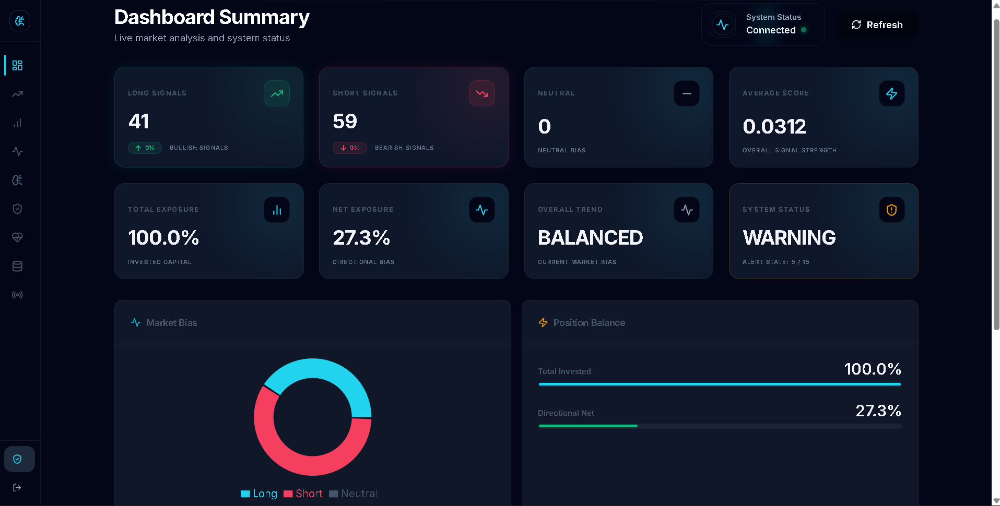<br/><sub><b>Metric Cards + Market Bias</b></sub></td>
    <td>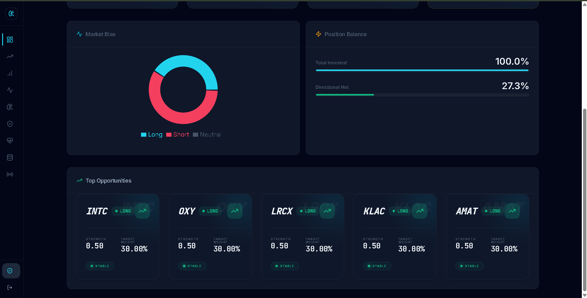<br/><sub><b>Top 5 Opportunities Grid</b></sub></td>
  </tr>
</table>

&nbsp;

---

### 📡 Market Signals

> Full universe of LONG / SHORT / NEUTRAL signals with direction filters, ticker search, and live sync.

<table>
  <tr>
    <td>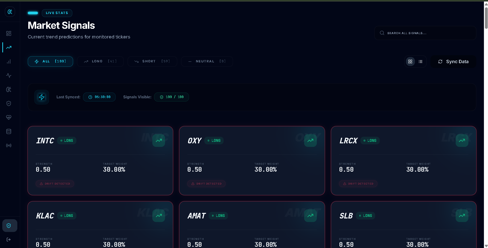<br/><sub><b>Signal Grid — All View</b></sub></td>
    <td>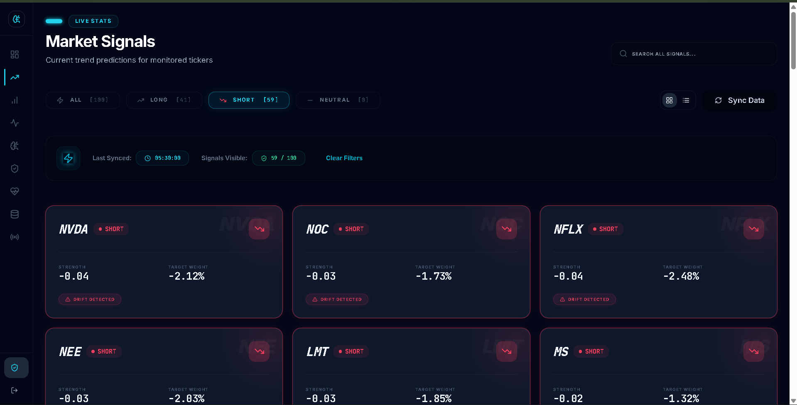<br/><sub><b>Filtered — LONG Signals</b></sub></td>
  </tr>
</table>

&nbsp;

---

### 🔍 Signal Detail

> Per-ticker drilldown: price history chart, agent vote breakdown, and full signal rationale.

<table>
  <tr>
    <td>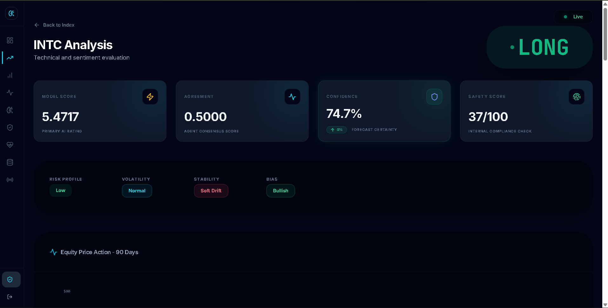<br/><sub><b>Analysis Panel</b></sub></td>
    <td>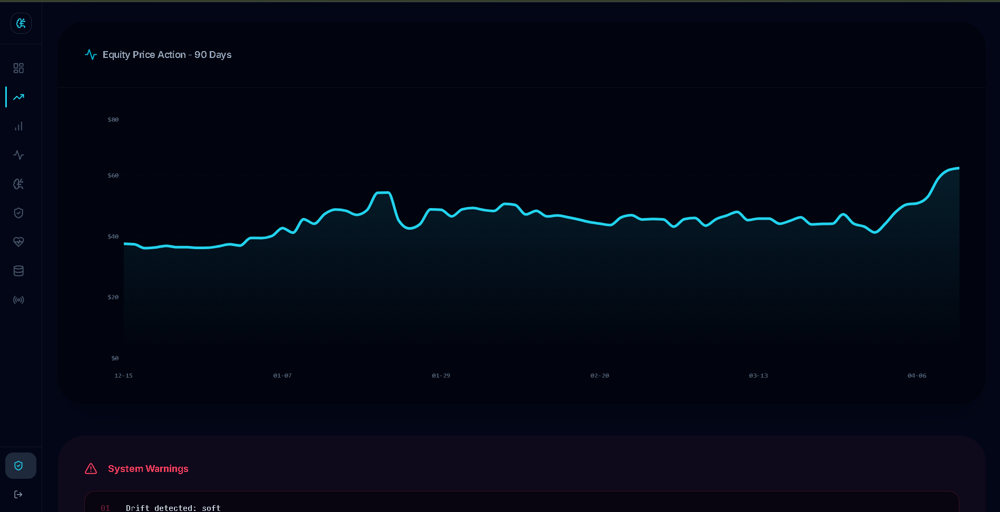<br/><sub><b>Agent Votes + LLM Report</b></sub></td>
  </tr>
</table>

&nbsp;

---

### 🤖 Agent Analysis

> Multi-agent LLM reasoning: AI Intelligence Report (4-panel), Political Risk scan, volatility tags, and price history.

<table>
  <tr>
    <td>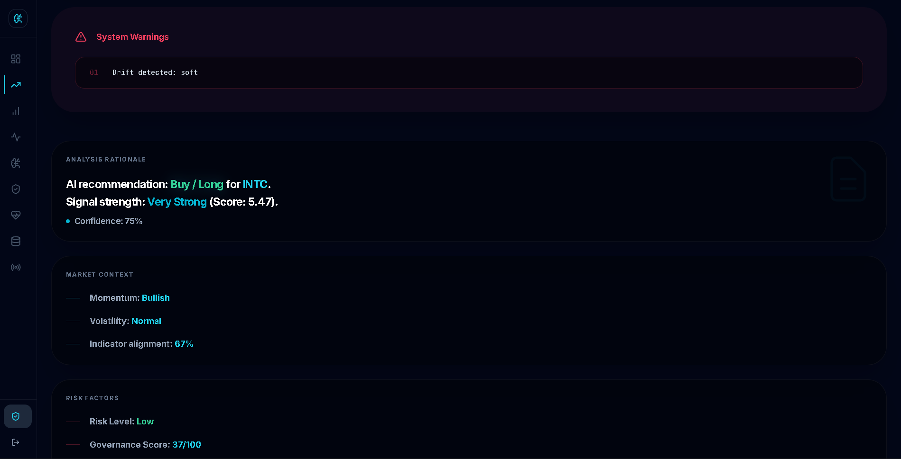<br/><sub><b>Analysis Header + Score Tags</b></sub></td>
    <td>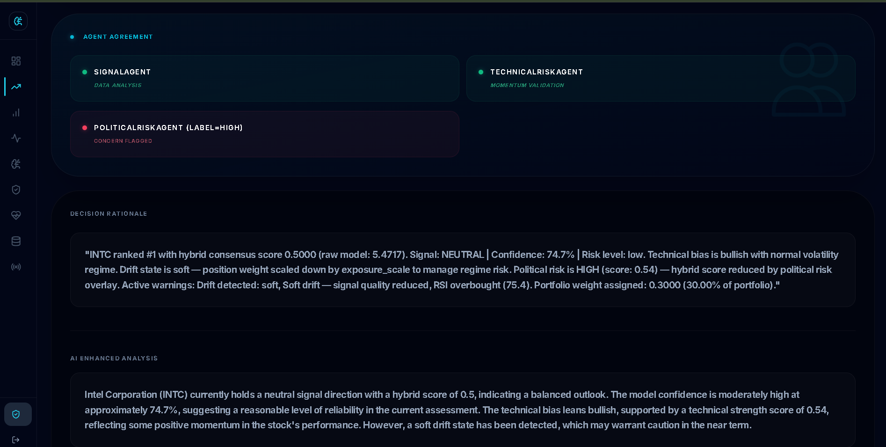<br/><sub><b>AI Intelligence Report</b></sub></td>
  </tr>
  <tr>
    <td>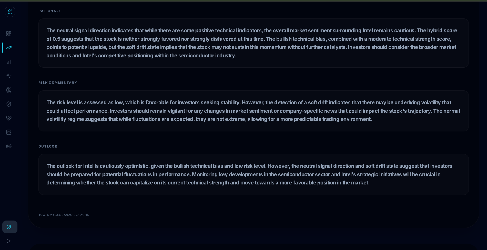<br/><sub><b>Political Risk + Price Chart</b></sub></td>
    <td>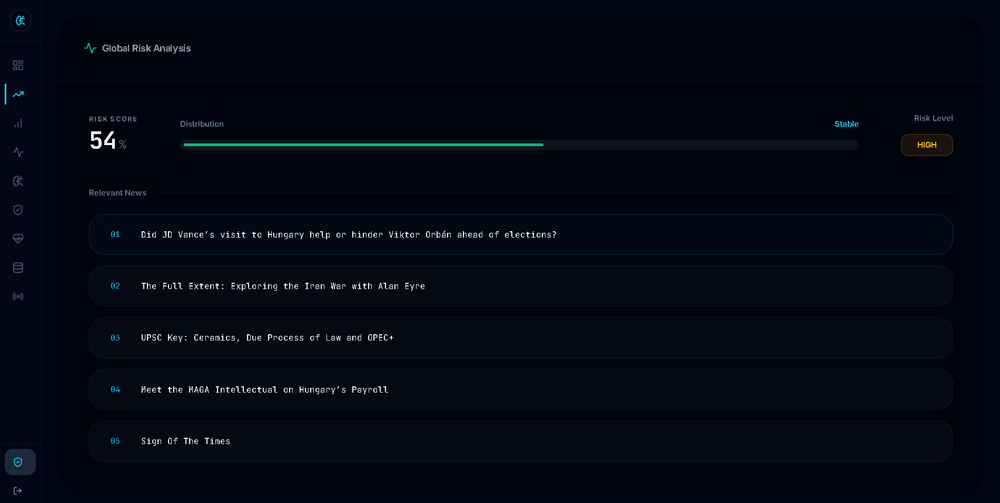<br/><sub><b>Additional Rationale</b></sub></td>
  </tr>
</table>

&nbsp;

---

### 📊 Portfolio Analytics

> Real-time gross/net exposure tracking with position breakdown and weight distribution.

<table>
  <tr>
    <td>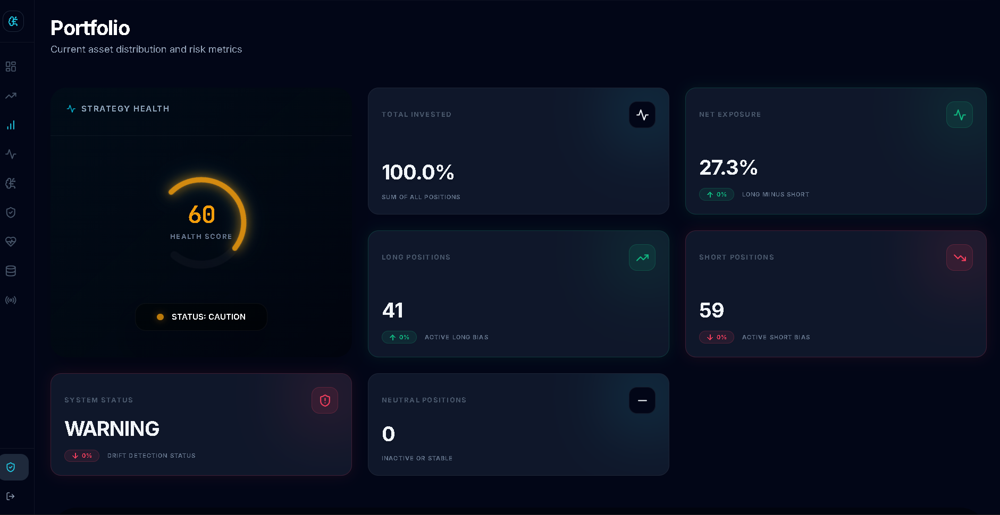<br/><sub><b>Exposure Gauges</b></sub></td>
    <td>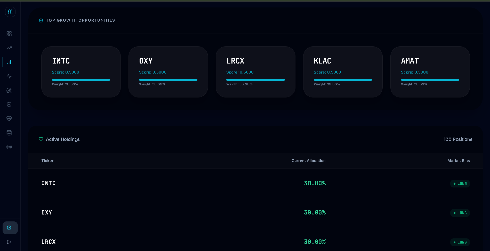<br/><sub><b>Position Ledger</b></sub></td>
  </tr>
</table>

&nbsp;

---

### 📈 Strategy Performance

> Total Return, Risk Score (Sharpe), Downside Protection (Sortino), Recovery Speed (Calmar), Max Loss, Success Rate.

<table>
  <tr>
    <td>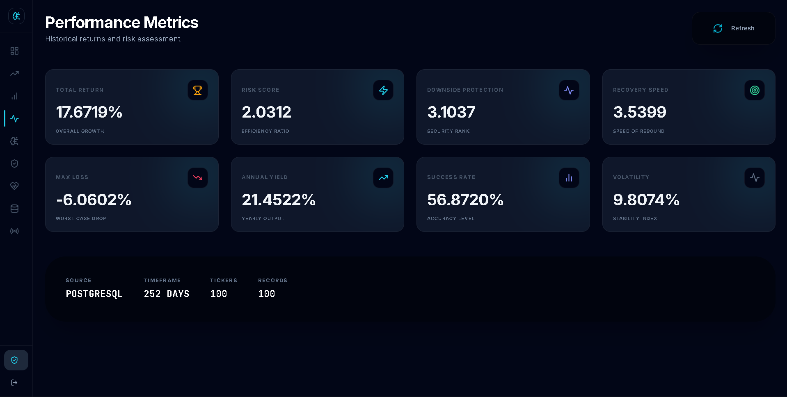<br/><sub><b>Risk Metric Grid</b></sub></td>
    <td></td>
  </tr>
</table>

&nbsp;

---

### 🧠 AI Model

> Model version, feature importance ranking, IC telemetry (signal quality grade), and artifact integrity hashes.

<table>
  <tr>
    <td>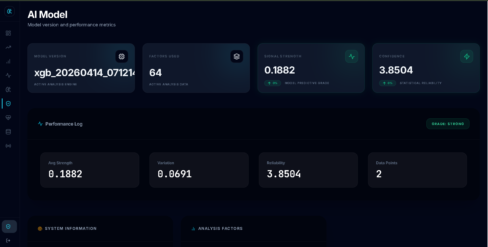<br/><sub><b>Model Version + IC Stats</b></sub></td>
    <td>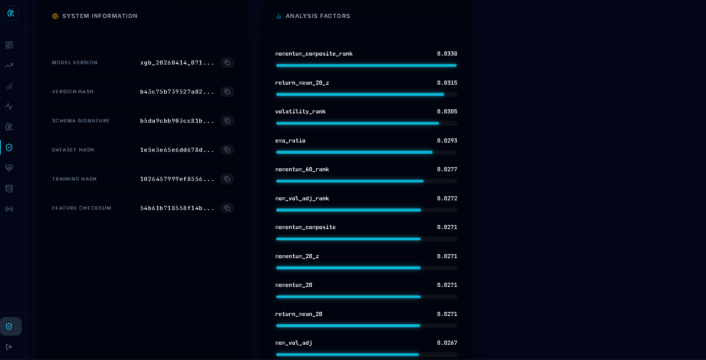<br/><sub><b>Feature Importance Bars</b></sub></td>
  </tr>
</table>

&nbsp;

---

### 🌊 Drift Monitor

> Live algorithmic drift state, severity score, exposure scaling factor, and historical drift timeline.

<table>
  <tr>
    <td>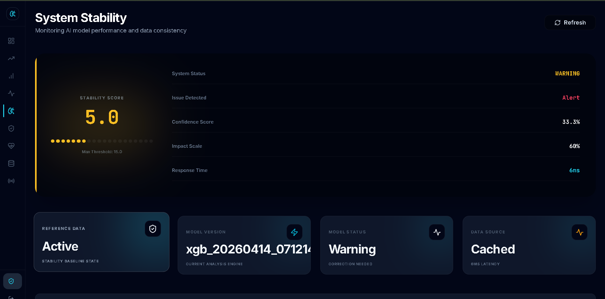<br/><sub><b>Drift State + Severity</b></sub></td>
    <td></td>
  </tr>
</table>

&nbsp;

---

### 💚 Health Center

> Unified connectivity status: API server, PostgreSQL database, Redis cache, and ML model.

<table>
  <tr>
    <td>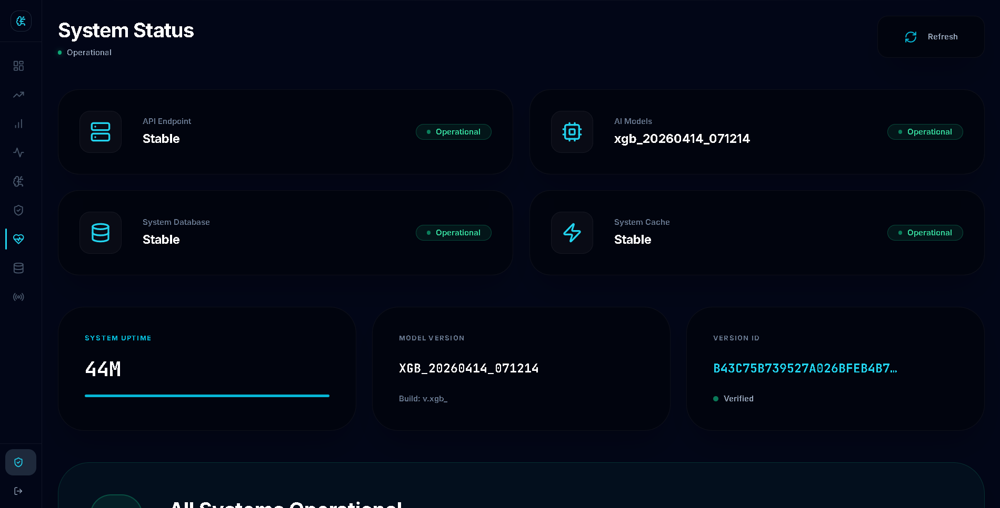<br/><sub><b>All Systems Online</b></sub></td>
    <td></td>
  </tr>
</table>

&nbsp;

---

### 🖥️ System Monitor

> Prometheus metrics, request history sparkline, per-endpoint bar chart, cache hit rate, and error rate.

<table>
  <tr>
    <td>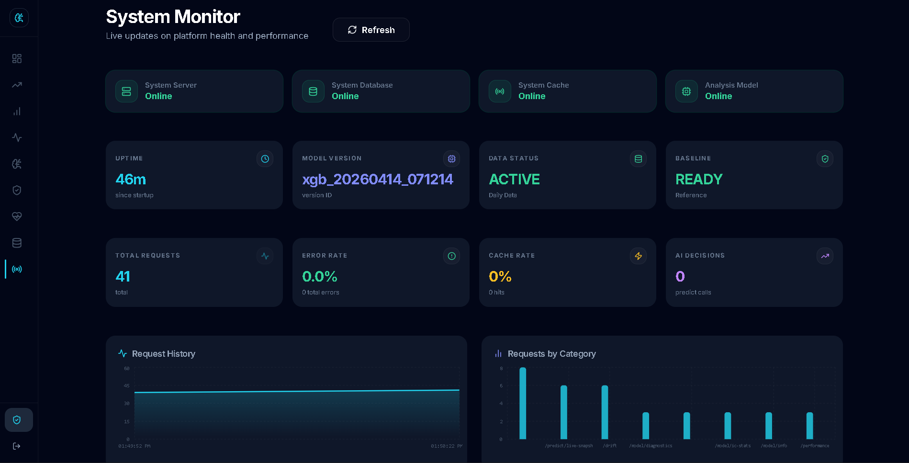<br/><sub><b>Status Strip + Stat Cards</b></sub></td>
    <td></td>
  </tr>
</table>

&nbsp;

---

### 📉 Metrics View

> High-velocity signal telemetry and real-time model output monitoring table.

<table>
  <tr>
    <td>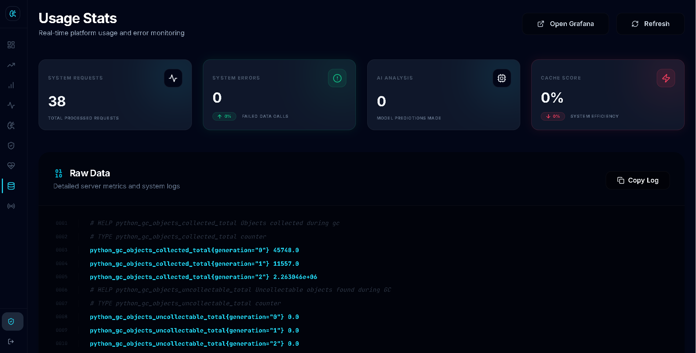<br/><sub><b>Signal Telemetry View</b></sub></td>
  </tr>
</table>

&nbsp;

---

### 👤 Demo Profile

> Quota tracker, feature usage dashboard, and locked feature gate for demo users.

<table>
  <tr>
    <td>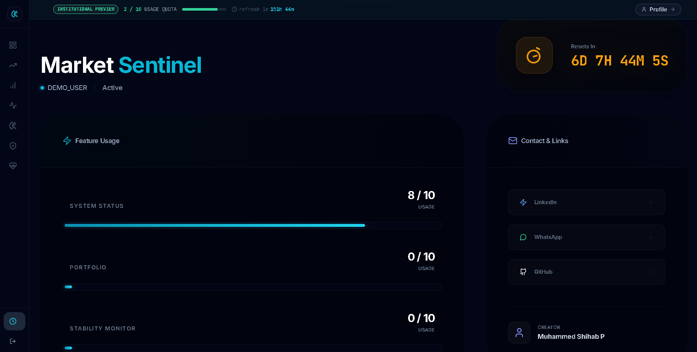<br/><sub><b>Quota Usage View</b></sub></td>
    <td></td>
  </tr>
</table>

&nbsp;

---

### 🔐 Login

> Secure access control for owner (full) and demo (quota-limited) users.

<table>
  <tr>
    <td width="50%">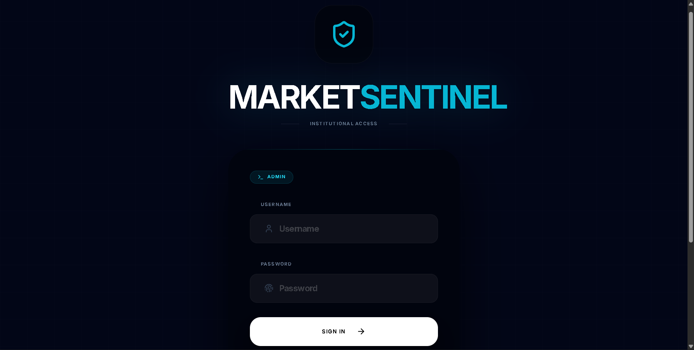<br/><sub><b>Authentication Screen</b></sub></td>
    <td width="50%">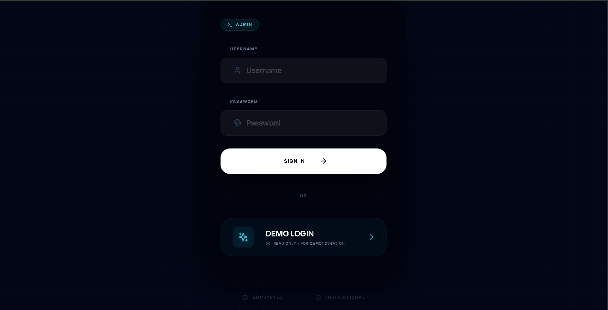<br/><sub><b>Auth Actions</b></sub></td>
  </tr>
</table>

&nbsp;

---

## 📋 Overview

**MarketSentinel UI** is a React 18 + TypeScript frontend for an institutional-grade quantitative trading intelligence system. It connects to a FastAPI backend running an XGBoost ensemble model + Multi-Agent LLM reasoning pipeline to deliver:

- **Live LONG / SHORT / NEUTRAL signals** for a universe of monitored equities
- **AI-powered rationale** from a multi-agent system (Signal Agent, Technical Risk Agent, Portfolio Decision Agent, Political Risk Agent)
- **Drift detection** with automatic weight scaling and alert states
- **Portfolio exposure tracking** with gross/net breakdown
- **Backtested strategy performance** reporting

The interface is designed as a professional dark-mode HUD — optimized for traders, analysts, and quantitative researchers.

---

## 🚀 Key Features

| Feature | Description |
|---|---|
| 🔴 **Live Signal Grid** | Real-time LONG / SHORT / NEUTRAL signals with direction filters and ticker search |
| 🤖 **LLM Intelligence Reports** | 4-panel AI analysis: Summary, Rationale, Outlook, Risk Commentary |
| 🌊 **Drift Detection** | Live stability monitoring with severity scoring and exposure auto-scaling |
| 📊 **Portfolio Ledger** | Gross/Net exposure gauges with position breakdown |
| 🧠 **Model Telemetry** | Feature importance, IC stats, signal quality grade, artifact integrity hashes |
| 🛡️ **Political Risk Scan** | GDELT-powered political risk scoring per ticker |
| 📈 **Performance Backtesting** | Total Return, Sharpe, Sortino, Calmar, Max Loss, Success Rate |
| 💚 **System Health** | Unified monitor for API, DB, Redis, and ML model |
| 🖥️ **Prometheus Monitoring** | Live request histograms, error rates, cache efficiency, inference counts |
| 🔐 **Role-Based Access** | Owner (full) and Demo (quota-limited) modes with automatic lockout UI |

---

## 🏗️ Architecture

<div align="center">
  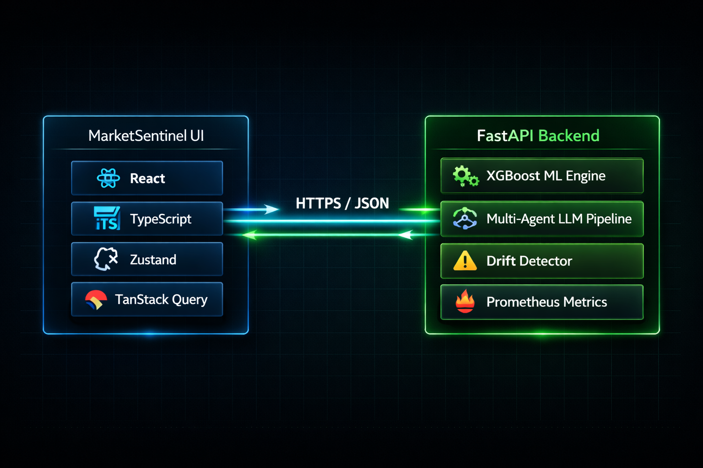
</div>

---

## 📁 Project Structure

```
market-sentinel-ui/
├── public/
│   └── screenshots/                  ← UI Screenshots
├── src/
│   ├── App.tsx                       ← Route definitions
│   ├── main.tsx                      ← Entry point
│   ├── index.css                     ← Design tokens + global styles
│   ├── charts/                       ← Recharts chart components
│   ├── components/                   ← Shared UI components
│   │   ├── DriftIndicator.tsx
│   │   ├── MetricCard.tsx
│   │   ├── NeuralScanner.tsx
│   │   ├── SignalBadge.tsx
│   │   ├── SignalCard.tsx
│   │   ├── SignalExplanation.tsx
│   │   ├── DemoBanner.tsx
│   │   ├── LockedFeature.tsx
│   │   └── ui/                       ← ShadCN base components
│   ├── layouts/
│   │   └── DashboardLayout.tsx       ← Sidebar + navigation shell
│   ├── lib/
│   │   ├── api.ts                    ← Typed API client (all endpoints)
│   │   ├── queryKeys.ts              ← TanStack Query key registry
│   │   └── utils.ts                  ← Utility helpers
│   ├── pages/                        ← One file per route
│   │   ├── Dashboard.tsx
│   │   ├── MarketSignals.tsx
│   │   ├── SignalDetail.tsx
│   │   ├── AgentExplanation.tsx
│   │   ├── PortfolioAnalytics.tsx
│   │   ├── StrategyPerformance.tsx
│   │   ├── Model.tsx
│   │   ├── Drift.tsx
│   │   ├── Health.tsx
│   │   ├── Monitoring.tsx
│   │   ├── Metrics.tsx
│   │   ├── DemoProfile.tsx
│   │   ├── Login.tsx
│   │   └── ModelOffline.tsx
│   ├── store/
│   │   ├── index.ts                  ← App store (selectedTicker)
│   │   └── authStore.ts              ← Auth + feature-quota store
│   └── types/
│       └── index.ts                  ← All TypeScript types, aligned to backend
├── LICENSE                           ← MIT License
├── Dockerfile                        ← Multi-stage Nginx production image
├── vite.config.ts                    ← Dev proxy + build config
├── tailwind.config.js
└── package.json
```

---

## 🛠️ Tech Stack

| Layer | Technology |
|---|---|
| Framework | React 18 + Vite 7 |
| Language | TypeScript 5 |
| Styling | TailwindCSS + ShadCN UI |
| Animations | Framer Motion |
| Charts | Recharts |
| Server State | TanStack Query v5 |
| Client State | Zustand |
| HTTP Client | Axios |
| Testing | Vitest + React Testing Library |
| Deployment | Docker (Nginx multi-stage) |

---

## 💻 Getting Started

### Prerequisites
- Node.js 18+
- npm 9+
- Running [MarketSentinel Backend](https://github.com/muhammedshihab1001/MarketSentinel)

### Installation

```bash
# Clone the repo
git clone https://github.com/muhammedshihab1001/MarketSentinel-UI.git
cd MarketSentinel-UI

# Install dependencies
npm install

# Configure environment
cp .env.example .env
# Edit .env — set VITE_API_BASE_URL to your backend URL
# Set VITE_GRAFANA_URL if you have Grafana installed
# Set VITE_ENV=production for production deployments
```

### Development

```bash
npm run dev
```

App runs at `http://localhost:5173` with API proxying to the backend.

### Production Build

```bash
npm run build     # TypeScript compile + Vite bundle
npm run preview   # Preview production build locally
```

### Tests

```bash
npm run test
```

---

## 🐳 Docker Deployment

```bash
# Build the image
docker build -t market-sentinel-ui .

# Run the container
docker run -p 80:80 market-sentinel-ui
```

---

## 🌐 Environment Variables

| Variable | Required | Description |
|---|---|---|
| `VITE_API_BASE_URL` | Production only | FastAPI backend URL (e.g. `https://api.your-domain.com`). Unset in dev — Vite proxy handles it. |
| `VITE_GRAFANA_URL` | Optional | Grafana dashboard URL. When unset, the "Open Grafana" button in Metrics is hidden. |
| `VITE_APP_NAME` | Optional | App display name. Default: `MarketSentinel Quant Dashboard` |
| `VITE_ENV` | Required | `development` \| `staging` \| `production`. Controls error message verbosity. |
| `VITE_API_TIMEOUT` | Optional | Axios timeout in ms. Default: `15000` |

> **Vercel deployment:** Set `VITE_API_BASE_URL`, `VITE_GRAFANA_URL`, and `VITE_ENV=production` in your Vercel project settings → Environment Variables.

## 📡 API Endpoints

| Endpoint | Purpose |
|---|---|
| `GET /prediction/snapshot` | Live signal snapshot |
| `GET /agent/explain/:ticker` | Per-ticker agent + LLM report |
| `GET /agent/political-risk/:ticker` | Political risk via GDELT |
| `GET /agent/agents` | Agent registry |
| `GET /prediction/snapshot/live` | Live snapshot for rationale |
| `GET /model/info` | Model version + artifact hashes |
| `GET /model/features` | Feature importance |
| `GET /model/ic-stats` | IC stats (30-day) |
| `GET /performance` | Strategy performance metrics |
| `GET /portfolio` | Portfolio positions + exposure |
| `GET /drift` | Drift state + severity |
| `GET /health/ready` | System health check |
| `GET /metrics` | Prometheus metrics |
| `GET /equity/history/:ticker` | OHLCV price history |

---

## 🔐 Access Modes

| Mode | Access | Features |
|---|---|---|
| **Owner** | Username + password | Full access to all pages including system monitoring |
| **Demo** | Public demo token | Quota-limited; pages show locked state after limit |

---

## 📄 Pages Reference

| Page | Route | Description |
|---|---|---|
| Dashboard | `/` | Signal overview, top-5, exposure gauges |
| Market Signals | `/signals` | Full signal grid with filters |
| Signal Detail | `/signals/:ticker` | Per-ticker detail + price chart |
| Agent Analysis | `/agent-explain` | LLM intelligence report + political risk |
| Portfolio Analytics | `/portfolio` | Gross/Net exposure + positions |
| Strategy Performance | `/performance` | Returns and risk scores |
| AI Model | `/model` | Feature importance, IC telemetry, hashes |
| Drift Monitor | `/drift` | Drift state and history |
| Health Center | `/health` | System connectivity status |
| System Monitor | `/monitoring` | Prometheus metrics + request charts |
| Metrics View | `/metrics` | Signal telemetry table |
| Demo Profile | `/profile` | Quota and permissions |
| Login | `/login` | Authentication |
| Model Offline | `/model-offline` | Graceful degradation view |

---

## 🔒 Security

This project follows security best practices for a production SPA:

| Control | Implementation |
|---|---|
| **Auth** | `httpOnly` cookie sessions — JS never sees the token |
| **XSS** | Zero `dangerouslySetInnerHTML` or `eval()` usage |
| **Tabnapping** | All `window.open(_blank)` calls use `noopener,noreferrer` |
| **Error Leakage** | Raw error messages suppressed in production via `VITE_ENV` |
| **Open Redirects** | All `window.location` redirects target hardcoded internal paths only |
| **Sensitive Storage** | `localStorage` persists only UI preferences — no credentials or tokens |
| **CSRF** | `withCredentials: true` on all Axios requests, cookie-based auth |

**Recommended Vercel security headers** (add to `vercel.json`):
```json
{ "key": "X-Content-Type-Options", "value": "nosniff" },
{ "key": "X-Frame-Options", "value": "DENY" },
{ "key": "Referrer-Policy", "value": "strict-origin-when-cross-origin" }
```

---

This project is licensed under the **MIT License** — see the [LICENSE](./LICENSE) file for details.

---

<div align="center">

**Muhammed Shihab P** 

*Built for institutional-grade market intelligence. Not financial advice.*

</div>
